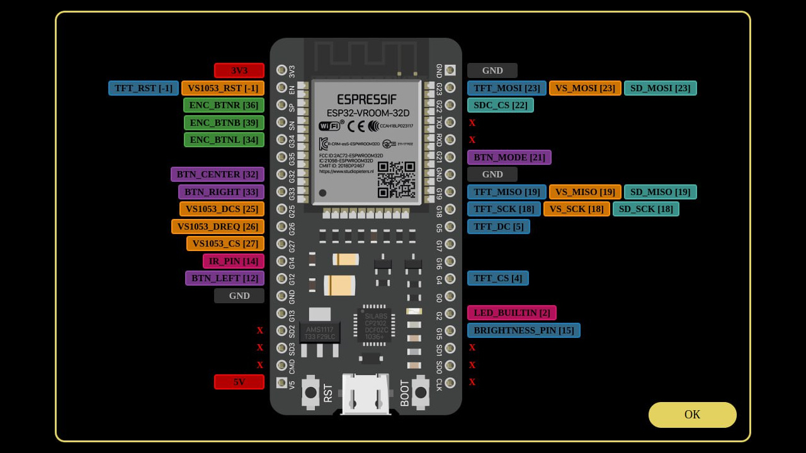

# ёRadio - simple myoptions.h generator

This is a tool to help you set up and flash the [ёRadio](https://github.com/e2002/yoradio) ESP32 web-radio project

This is a dynamic html page that runs in a browser (chrome, firefox, opera) or online. After some actions, using the mouse and keyboard, the output is the configuration file **myoptions.h**, completely ready for use in the project.

[Click here to use the tool!](https://e2002.github.io/docs/myoptions-generator.html)

## Notes

Original Layout and format and coding by e2002 (for ESP32), made dynamic by Trip5 (for ESP32-S3, ESP32-C3, more).

### Features

* Dropdown selector to change boards (includes ESP32, ESP32-S3, ESP32-C3 boards including modules in case no board is appropriate)

* Adds correct MCU type to options export

* Previews of all boards available in selector

* A board pinout now included so you can see which pins are available (click to zoom)

* Dynamic Javascript / HTML so that certain text is shown / hidden according to board or MCU type

* Handles HSPI which is default of ESP32-S3 and ESP32-C3 boards correctly (both for selecting and exporting)

* Adds Neopixel pin and option under LED to use an RGB Neopixel - also exports correctly

* 100% compatible (probably) with current options

### The to-do list

* Add some more ESP32 and ESP32-S3 and ESP32-C3 boards

### Trip5

Trip5's version online [here](https://trip5.github.io/yoradio-docs/docs/myoptions-generator.html). Trip5's repo [here](https://github.com/trip5/yoradio-docs).